
**English** ・ [日本語](#jp)

# AI Session Archiver (ASA)

**Save and back up your ChatGPT, Claude, and Gemini conversations to your own PC — with a single click.**

AI Session Archiver (ASA) is a Windows app that saves the conversation currently on your screen as HTML, plain text, Markdown, or PDF. There is no limit on how many times you can save.

It works with the web (browser) versions of ChatGPT, Claude, and Gemini, so you can choose the edition that matches the service you use. Just press the small save button (widget) added to the chat screen, and your conversation is stored on your own PC. Title, tags, and destination folder are all freely configurable, so ASA fits naturally into your everyday workflow.

**Everything stays on your device.** Nothing is uploaded to the cloud or sent anywhere externally.

## Highlights

- **One-click save, no limits** — no copy-pasting, no screenshots. Save an entire conversation with a single button.
- **Export four formats at once** — output HTML, PDF, Markdown, and plain text together in a single save.
- **Fully local and private** — everything is stored on your own Windows PC. Nothing is sent to the cloud.
- **Insurance against lost chats** — for conversations that disappear when the page is closed by mistake or a crash, such as temporary chats, capture mode plus auto-recovery has you covered.
- **One-time pricing, no subscription** — pay once and use it as much as you like. Let ASA help you cut down on your monthly subscriptions.

## Screenshots

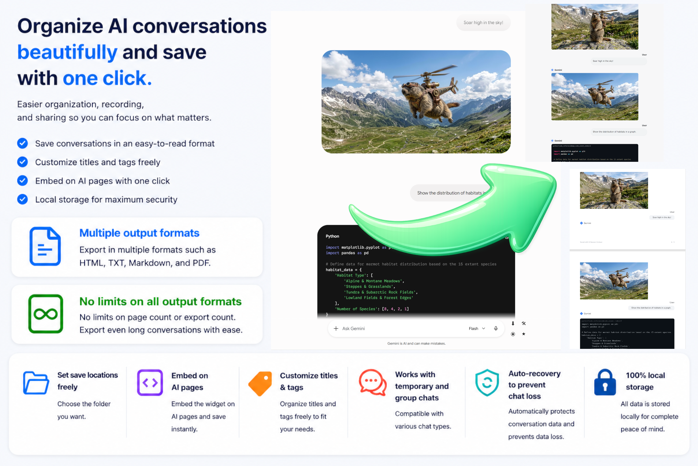

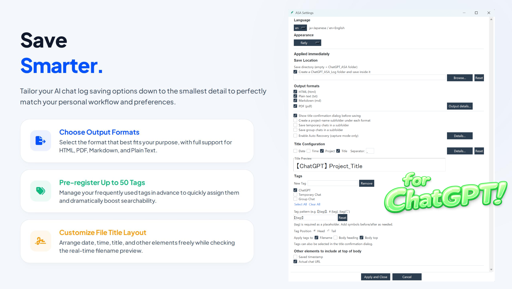

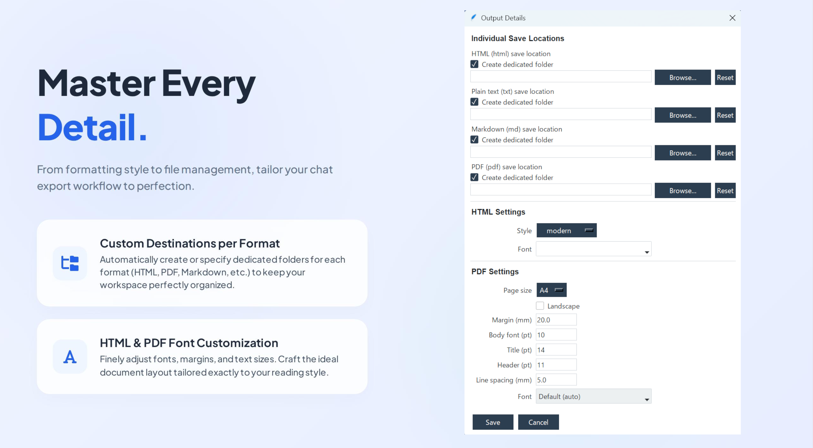

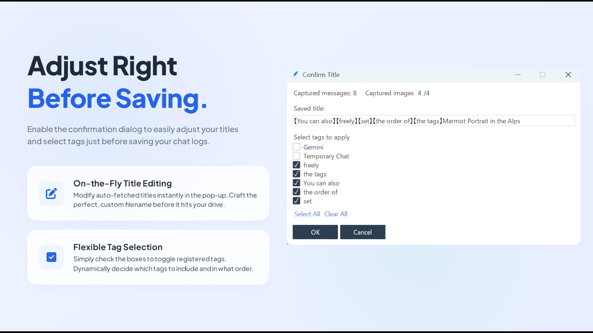

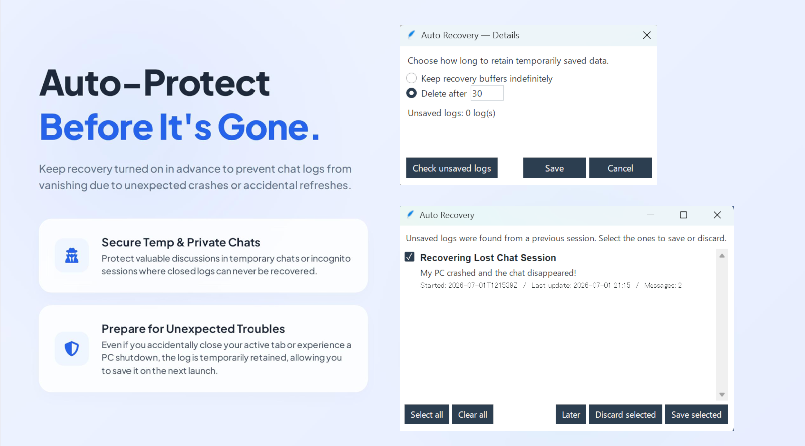

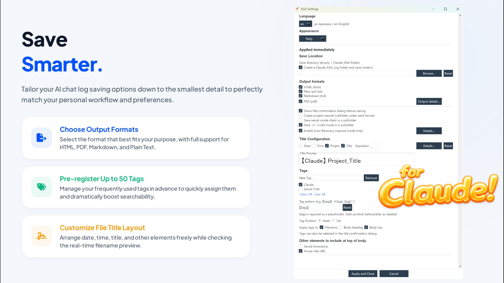

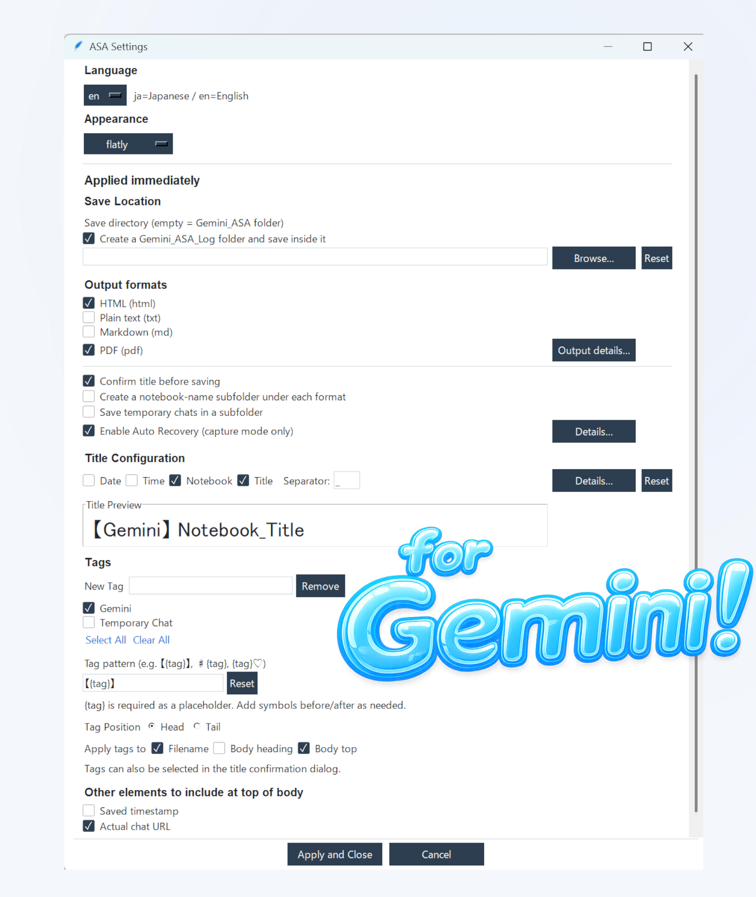

## Where to Get It

ASA is available from the following stores:

- **BOOTH:** https://jellycotton.booth.pm/items/8436423
- **Lemon Squeezy:** https://dialoguevolts.lemonsqueezy.com/checkout/buy/8929260b-12e8-4ac4-8e9c-e878e6b6049a

This repository is for **product information only** — the tool itself is not distributed here. Please get it from the stores above.

A **Free Edition** (HTML save only, free forever) is also available — see [Free Edition](#free-edition) below.

## Specifications

- **Product name:** AI Session Archiver (ASA)
- **Lineup:** ChatGPT edition / Claude edition / Gemini edition
- **Supported OS:** Windows 10 / 11
- **Requirements:** Google Chrome
- **Output formats:** HTML / plain text (txt) / Markdown (md) / PDF
- **Storage:** On your device (fully local — no cloud upload)
- **Key features:**
  - One-click save widget
  - Capture mode
  - Auto-recovery (prevents loss of unsaved data)
  - Tagging (up to 50) / freely composed titles
  - Purpose-based subfolder routing / detailed PDF settings
  - Update check
- **Integration:** Chrome extension (distributed via the Web Store) + desktop app
- **Languages:** Japanese / English

## How to Use

1. Open a conversation page of an AI website in Chrome
2. Display the conversation you want to save
3. Click the ⬇ (save) on the widget — the conversation is saved
   (If the title confirmation dialog is enabled, continue to step 4)
4. In the title confirmation dialog you can edit the title and choose tags. Press OK to save.

## Main Features

**Save**
Saves the conversation currently on screen, as is.

**Capture mode**
Follows the screen as you scroll, gathering content and stitching it back into a single conversation before saving. While active, it keeps holding the conversation in real time.

**Auto-recovery**
Only during capture mode, it temporarily keeps the conversation even if you close the app or Chrome before saving. (Works only when enabled in settings.) On the next launch, if an unsaved conversation is found, a screen appears asking whether to save it. Intended for situations — such as temporary chats — where a conversation could be lost to a misclick or accident.

**Tagging**
Tags (labels) can be applied in three places: the file name, the title in the body, and the beginning of the body. Up to 50 can be registered, and you can choose whether they go at the start or end of the title.

**Title composition**
Builds the file name from parts such as date, time, and service name, arranged in the order you choose. Date/time formats and separators are adjustable. You can also edit the title on the spot before saving.

**Destination routing**
Beyond a shared destination, you can set an individual destination per format (HTML / md / txt / PDF). Subfolder splitting by format, and routing by project name or chat type, are also supported.

**Detailed PDF settings**
Page size, font, margins, and more can be configured. Custom fonts can be specified.

**Update notice**
Enable "Notify me at startup if a new version is available" in settings and ASA will show a notice with links to BOOTH/Lemon Squeezy when a newer version exists. Disabled by default. Checks happen at most once every 24 hours. Checking "Don't notify me about this version again" before closing the notice keeps it from reappearing until the next version is released (otherwise it may show again for the same version after 24 hours). This check only contacts GitHub to read the latest version number — it never sends your conversations or any other data.

## Free Edition

AI Session Archiver is also available as a **Free Edition** you can use forever at no cost — no time or usage limits, just a smaller feature set. It's a good way to check whether ASA fits your workflow.

The Free Edition is available from the same store pages ([BOOTH](https://jellycotton.booth.pm/items/8436423) / [Lemon Squeezy](https://dialoguevolts.lemonsqueezy.com/checkout/buy/8929260b-12e8-4ac4-8e9c-e878e6b6049a)) — just select the Free Edition option there.

**Included in the Free Edition**
- One-click save widget (including capture mode)
- Save as HTML (unlimited)
- Title confirmation dialog, title composition, and custom save location
- Tagging (file name only, up to 3 tags)
- Language and appearance switching

**Unlocked only in the paid edition**
- Export to PDF, Markdown, and plain text
- Auto-recovery
- Purpose-based subfolder routing
- Detailed output settings (e.g. PDF configuration)
- Tagging on the in-body title/heading, and a higher tag limit (up to 50)

The Free Edition and the paid edition share the same browser extension and setup — switching to the paid edition later is just a reinstall (running both at once on the same PC isn't supported).

## System Requirements

- **OS:** Windows 10 / 11
- **Requirements:** Google Chrome
- No Python installation needed (bundled with the executable)

## Getting Started

1. Get the edition you need from [BOOTH](https://jellycotton.booth.pm/items/8436423) or [Lemon Squeezy](https://dialoguevolts.lemonsqueezy.com/checkout/buy/8929260b-12e8-4ac4-8e9c-e878e6b6049a)
2. Extract the downloaded ZIP to any location
3. Run the setup file inside the folder
4. Follow the guide to add the extension from the Chrome Web Store

Detailed steps are provided in the bundled manual (README).

## Notes

- Due to specification changes on the AI service side, the tool may stop working without notice.
- In environments with mixed monitor resolutions, the display may break. This version is recommended for use on the main monitor.
- When using this tool, please review the terms of service of each AI service.

## Copyright / License

© 2026 Dialogue & Volts

- Copyright of this software belongs to Dialogue & Volts.
- It may be used within the scope of the purchaser's own personal use.
- Redistribution, resale, and distribution of modified versions are prohibited.
- This software is provided "as is" and its operation is not guaranteed.
- The author is not liable for any damages arising from its use.

This product uses the following open-source software:
reportlab / ttkbootstrap / Markdown / Python / Tcl-Tk
(See the bundled OSS_LICENSES.txt for each license.)

---

[English](#en) ・ **日本語**

# AI Session Archiver（ASA）

**ChatGPT・Claude・Gemini の会話を、ワンクリックで自分のPCに保存・バックアップ。**

AI Session Archiver（ASA）は、いま画面に表示している会話をそのまま HTML・プレーンテキスト・Markdown・PDF で保存できる Windows アプリです。保存できる回数に制限はありません。

ChatGPT・Claude・Gemini のウェブ（ブラウザ）版に対応し、使っているサービスに合わせて版を選べます。チャット画面に追加される小さな保存ボタン（ウィジェット）を押すだけで、会話が手元のPCに保存されます。タイトル・タグ・保存先フォルダは自由に設定でき、普段の作業にそのまま馴染みます。

**データはすべて自分の端末に保存されます。** クラウドへのアップロードや外部への送信は一切ありません。

## 特長

- **ワンクリックで保存、回数無制限** — コピペもスクリーンショットも不要。ボタンひとつで会話をまるごと保存します。
- **4つの形式を同時出力** — HTML・PDF・Markdown・プレーンテキストから、必要な分だけまとめて一度に書き出せます。
- **完全にローカル・非公開** — すべて自分の Windows PC 内に保存。クラウドへの送信はありません。
- **チャット消失への保険** — 一時チャットなど、誤操作やクラッシュでページが閉じられると失われてしまうチャットに対して、キャプチャモード＋オートリカバリー機能で備えます。
- **月額不要の買い切り** — 一度の支払いでずっと使い放題。ASA で、少しでも毎月のサブスクリプションを減らしましょう。

## スクリーンショット

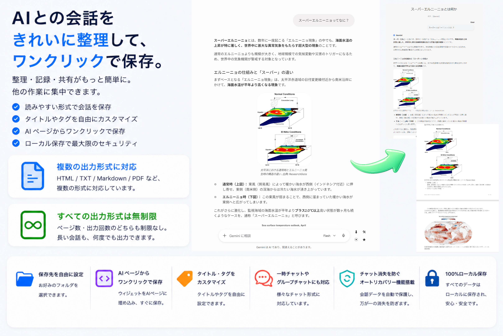

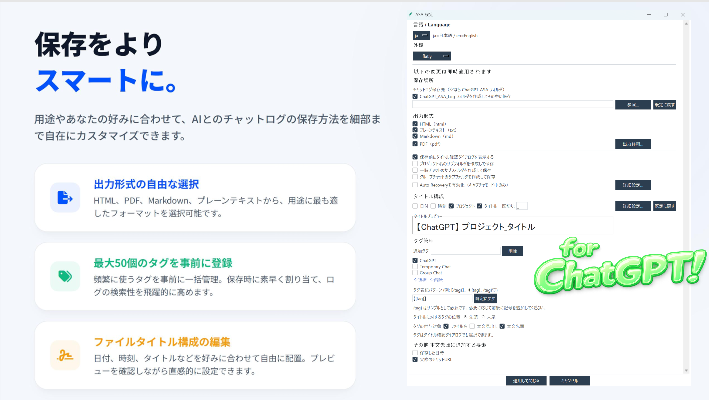

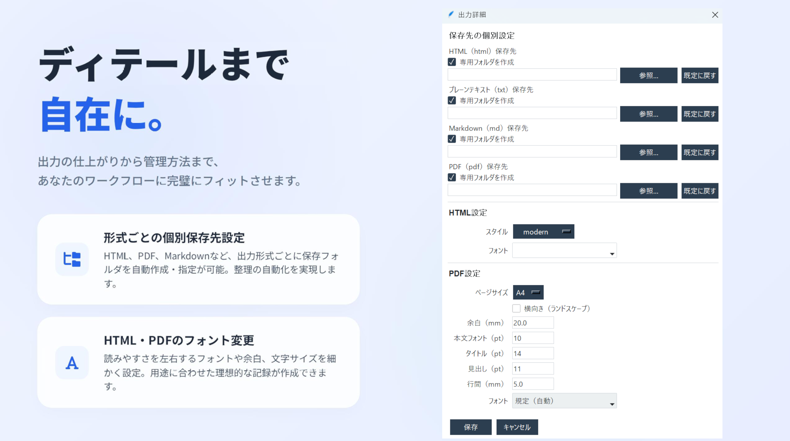

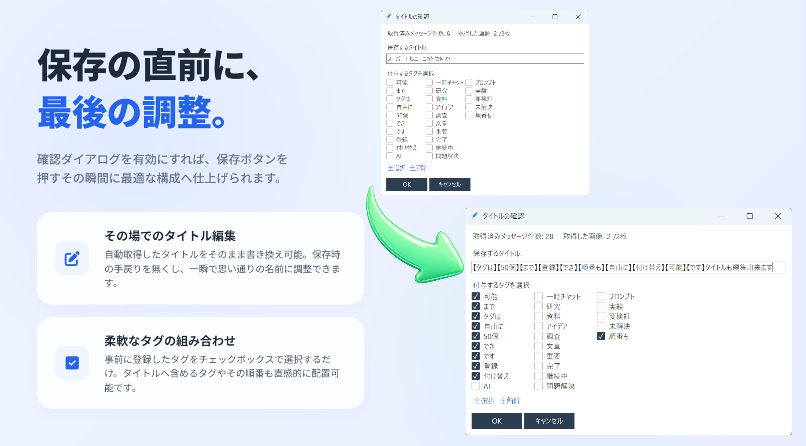

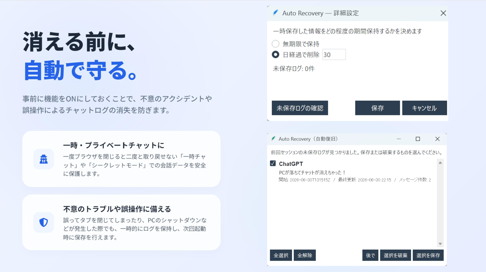

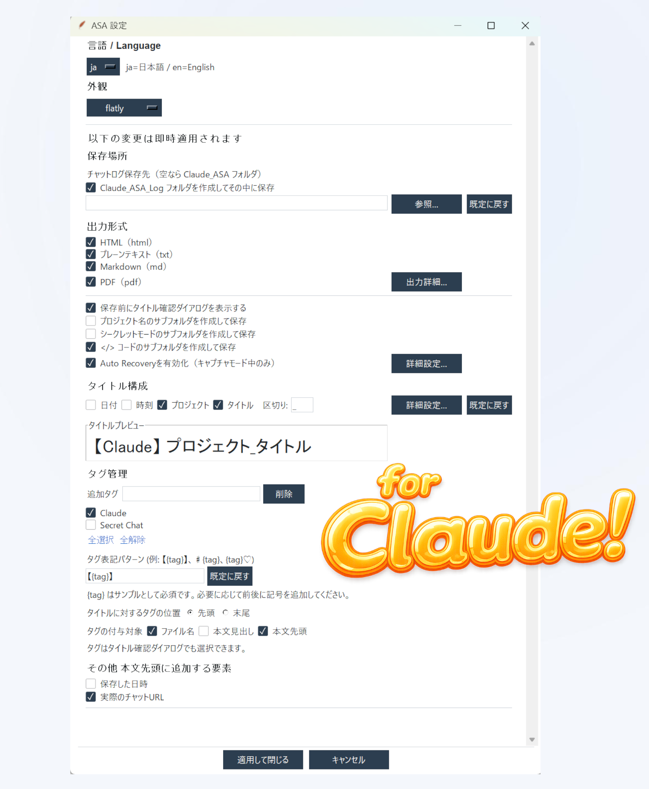

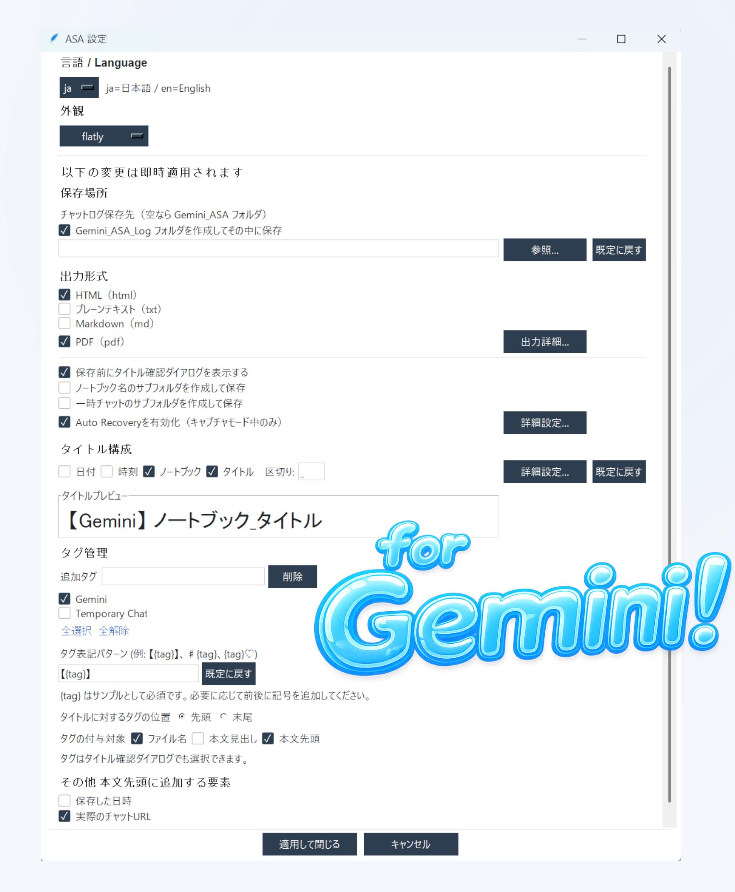

## 入手方法

以下のストアから入手できます。

- **BOOTH:** https://jellycotton.booth.pm/items/8436423
- **Lemon Squeezy:** https://dialoguevolts.lemonsqueezy.com/checkout/buy/8929260b-12e8-4ac4-8e9c-e878e6b6049a

このリポジトリは**製品紹介のみ**で、ツール本体は配布していません。上記ストアから入手してください。

機能を絞った**無料版**（HTML保存のみ・期限なし）もあります。詳しくは下の[無料版について](#無料版について)をご覧ください。

## 仕様

- **製品名:** AI Session Archiver（ASA）
- **ラインナップ:** ChatGPT版 / Claude版 / Gemini版
- **対応OS:** Windows 10 / 11
- **必要環境:** Google Chrome
- **出力形式:** HTML / プレーンテキスト（txt）/ Markdown（md）/ PDF
- **保存先:** 自分の端末（完全ローカル・クラウド送信なし）
- **主な機能:**
  - ワンクリック保存ウィジェット
  - キャプチャモード
  - オートリカバリー（未保存データの消失を防止）
  - タグ付け（最大50個）/ 自由なタイトル構成
  - 用途別サブフォルダ振り分け / PDF詳細設定
  - 更新チェック
- **連携:** Chrome拡張（ウェブストア配布）＋ デスクトップアプリ
- **言語:** 日本語 / 英語

## 使い方

1. Chrome で AI サービスの会話ページを開く
2. 保存したい会話を表示する
3. ウィジェットの ⬇（保存）をクリック — 会話が保存されます
   （タイトル確認ダイアログが有効な場合は手順4へ）
4. タイトル確認ダイアログでタイトル編集・タグ選択ができます。OK で保存。

## 主な機能

**保存**
いま画面に表示している会話を、そのまま保存します。

**キャプチャモード**
スクロールに追従して内容を集め、ひとつの会話につなぎ直してから保存します。作動中は会話をリアルタイムに保持し続けます。

**オートリカバリー**
キャプチャモード中に限り、保存前にアプリやChromeを閉じても会話を一時的に保持します（設定で有効化した場合のみ）。次回起動時に未保存の会話が見つかると、保存するか尋ねる画面が出ます。一時チャットなど、誤操作や事故で失われかねない場面を想定しています。

**タグ付け**
タグ（ラベル）はファイル名・本文タイトル・本文先頭の3か所に付けられます。最大50個まで登録でき、タイトルの先頭・末尾どちらに置くかも選べます。

**タイトル構成**
日付・時刻・サービス名などのパーツを、好きな順に並べてファイル名を組み立てます。日付/時刻の形式や区切り文字も調整可能。保存直前にその場でタイトルを編集することもできます。

**保存先の振り分け**
共通の保存先に加え、形式ごと（HTML / md / txt / PDF）に個別の保存先を設定できます。形式別のサブフォルダ分けや、プロジェクト名・チャット種別による振り分けにも対応。

**PDF詳細設定**
ページサイズ・フォント・余白などを設定できます。カスタムフォントの指定も可能。

**更新通知**
設定の「起動時に新しいバージョンがあれば通知する」を有効にすると、新しいバージョンが公開されている場合に BOOTH／Lemon Squeezy へのリンク付きで通知します。既定はオフです。確認は最大24時間に1回まで。通知内の「このバージョンについては次回から通知しない」にチェックを入れてから閉じると、次の新バージョンが出るまで再表示されません（チェックしない場合は24時間後に同じバージョンでも再度表示されます）。この確認では GitHub に接続して最新バージョン番号を取得するのみで、会話内容などのデータは一切送信しません。

## 無料版について

AI Session Archiver には、無料版もあります。HTML保存に機能を絞ったシンプル版で、日数や回数に制限はありません。ASA の使い勝手を確認したい方に向いています。

無料版も有料版と同じストアページ（[BOOTH](https://jellycotton.booth.pm/items/8436423)／[Lemon Squeezy](https://dialoguevolts.lemonsqueezy.com/checkout/buy/8929260b-12e8-4ac4-8e9c-e878e6b6049a)）から入手できます。ページ内で無料版を選んでください。

**無料版でできること**
- ワンクリック保存ウィジェット（キャプチャモードを含む）
- HTML形式での保存（回数無制限）
- タイトル確認ダイアログ、タイトル構成、保存先フォルダの変更
- タグ付け（ファイル名へ最大3個まで）
- 言語・外観の切り替え

**有料版でのみ解放される機能**
- PDF／Markdown／テキストでの出力
- オートリカバリー
- 用途別サブフォルダ振り分け
- PDF詳細設定などの出力詳細設定
- タグの本文タイトル・本文冒頭への付与、タグ登録数の拡張（最大50個）

無料版・有料版は同じ拡張機能を使うため、後から有料版に切り替える場合は入れ替えだけで済みます（無料版と有料版の同時利用はできません）。

## 動作環境

- **OS:** Windows 10 / 11
- **必要環境:** Google Chrome
- Python のインストール不要（実行ファイルに同梱）

## はじめかた

1. [BOOTH](https://jellycotton.booth.pm/items/8436423) または [Lemon Squeezy](https://dialoguevolts.lemonsqueezy.com/checkout/buy/8929260b-12e8-4ac4-8e9c-e878e6b6049a) から必要な版を入手
2. ダウンロードしたZIPを任意の場所に展開
3. フォルダ内のセットアップファイルを実行
4. ガイドに従って Chrome ウェブストアから拡張機能を追加

詳しい手順は同梱のマニュアル（README）に記載しています。

## 注意事項

- AIサービス側の仕様変更により、予告なく動作しなくなる場合があります。
- モニター解像度が混在する環境では表示が崩れることがあります。本バージョンはメインモニターでの使用を推奨します。
- 本ツールの利用にあたっては、各AIサービスの利用規約をご確認ください。

## 著作権 / ライセンス

© 2026 Dialogue & Volts

- 本ソフトウェアの著作権は Dialogue & Volts に帰属します。
- 購入者ご本人の私的利用の範囲内でご利用いただけます。
- 再配布・再販売・改変版の配布は禁止です。
- 本ソフトウェアは「現状のまま」提供され、動作を保証するものではありません。
- 利用により生じたいかなる損害についても、作者は責任を負いません。

本製品は以下のオープンソースソフトウェアを使用しています:
reportlab / ttkbootstrap / Markdown / Python / Tcl-Tk
（各ライセンスは同梱の OSS_LICENSES.txt を参照）
